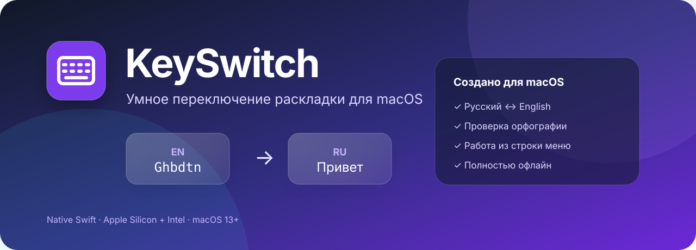

<div align="center">
  
</div>

<div align="center">

[](#системные-требования)
[](#сборка-из-исходного-кода)
[](#приватность)
[](CHANGELOG.md)
[](https://github.com/Andrles/KeySwitch/releases/latest)

**KeySwitch автоматически исправляет слова, набранные в неверной русской или английской раскладке.**

[English](README.en.md) · [Скачать](https://github.com/Andrles/KeySwitch/releases/latest) · [Возможности](#возможности) · [Установка](#установка) · [Решение проблем](#решение-проблем)

</div>

## Возможности

- Автоматически распознаёт русские и английские слова после завершения ввода.
- Исправляет неверную раскладку и синхронизирует источник ввода macOS.
- Использует системные офлайн-словари и встроенный словарь имён.
- Проверяет орфографию и умеет исправлять очевидные опечатки.
- Конвертирует текущее слово двойным нажатием Shift.
- Позволяет исключать приложения прямо из меню в строке меню.
- Показывает приложения-исключения с названиями и иконками.
- Работает в строке меню и не требует постоянного окна в Dock.
- Не отправляет введённый текст в интернет.

### Примеры

| Ввод | Результат |
|---|---|
| `Ghbdtn` | `Привет` |
| `руддщ` | `hello` |
| `vj;tn` | `может` |
| `Ьщысщц` | `Moscow` |
| `Alexandr` | `Alexander` при включённом автоисправлении |

## Установка

> [Скачать последнюю версию KeySwitch](https://github.com/Andrles/KeySwitch/releases/latest)

### Через Терминал

```sh
/bin/zsh -c "$(curl -fsSL https://raw.githubusercontent.com/Andrles/KeySwitch/main/scripts/install.sh)"
```

Команда загружает `KeySwitch.pkg` из последнего опубликованного GitHub Release,
запрашивает пароль администратора для установки в `/Applications` и запускает
приложение. Перед выполнением скрипт можно
[просмотреть в репозитории](scripts/install.sh).

### Вручную

1. Скачайте последний `KeySwitch-*.pkg` или `KeySwitch-*.zip` со страницы **Releases**.
2. Переместите KeySwitch в папку `/Applications`, если используете ZIP.
3. Запустите приложение.
4. Разрешите доступ: **Системные настройки → Конфиденциальность и безопасность → Универсальный доступ**.

Текущие локальные сборки подписываются ad-hoc и не нотаризованы Apple. Для публичного релиза рекомендуется подпись Developer ID и notarization.

## Использование

- Печатайте как обычно — KeySwitch проверяет слово после пробела или знака-разделителя.
- Дважды нажмите Shift, чтобы вручную конвертировать текущее слово.
- Нажмите иконку KeySwitch в строке меню, чтобы приостановить автоматику, открыть настройки или добавить активное приложение в исключения.
- В настройках можно отдельно отключить проверку орфографии и её автоисправление.

## Приватность

Обработка клавиатурного ввода выполняется локально на Mac. KeySwitch не использует сетевые запросы, не создаёт историю введённого текста и не отправляет слова сторонним сервисам. Разрешение «Универсальный доступ» необходимо только для чтения клавиатурных событий и замены ошибочно введённых символов.

Подробнее: [Политика приватности](PRIVACY.md).

## Системные требования

| Компонент | Требование |
|---|---|
| macOS | 13 Ventura или новее |
| Процессор | Apple Silicon или Intel |
| Разрешение | «Универсальный доступ» |
| Подключение к интернету | Не требуется для работы |

## Решение проблем

### KeySwitch запущен, но не исправляет текст

1. Откройте **Системные настройки → Конфиденциальность и безопасность → Универсальный доступ**.
2. Убедитесь, что доступ для KeySwitch включён.
3. Если разрешение уже включено, выключите его, включите снова и перезапустите KeySwitch.
4. Проверьте, что активное приложение не добавлено в исключения.

### macOS сообщает, что приложение получено из неизвестного источника

Откройте **Системные настройки → Конфиденциальность и безопасность** и подтвердите
запуск KeySwitch. Текущие сборки подписаны ad-hoc и пока не нотаризованы Apple.

### Как временно отключить автоматическое переключение

Нажмите иконку KeySwitch в строке меню и выберите **Приостановить автоматику**.

Если проблема сохраняется, создайте
[отчёт об ошибке](https://github.com/Andrles/KeySwitch/issues/new) и укажите
версию macOS, версию KeySwitch, исходное слово и ожидаемый результат.

## Сборка из исходного кода

Понадобятся Xcode Command Line Tools.

```sh
git clone https://github.com/Andrles/KeySwitch.git
cd KeySwitch
./scripts/test.sh
./scripts/build.sh
./scripts/package.sh
```

Артефакты появятся в каталоге `build/`. Сборка универсальная: `arm64` + `x86_64`.

## Структура проекта

```text
Sources/      код приложения на Swift и AppKit
Resources/    Info.plist и настройки установочного пакета
Tests/        регрессионные тесты языкового движка
scripts/      сборка, тестирование, иконка и упаковка
docs/         графика и документация
```

## Участие в разработке

Сообщения об ошибках и предложения приветствуются. Перед pull request ознакомьтесь с [CONTRIBUTING.md](CONTRIBUTING.md). Для отчёта об ошибке приложите версию macOS, версию KeySwitch, исходную строку и ожидаемый результат.

## Лицензия

Исходный код опубликован для ознакомления. Все права защищены — см. [LICENSE.md](LICENSE.md).
