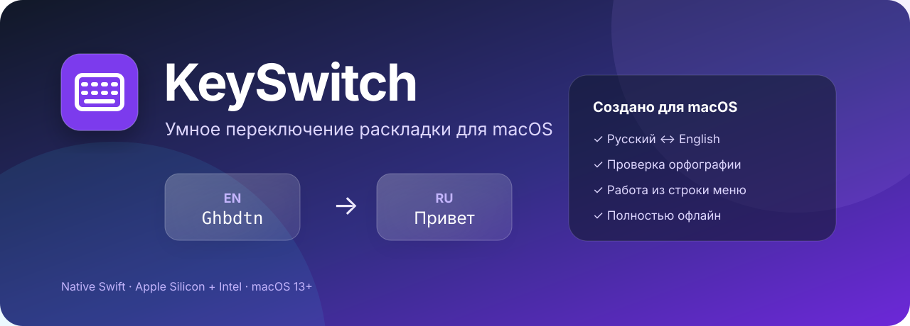

<div align="center">
  
</div>

<div align="center">

[](#системные-требования)
[](#сборка-из-исходного-кода)
[](#приватность)
[](CHANGELOG.md)
[](https://github.com/Andrles/KeySwitch/releases/latest)
[](https://github.com/Andrles/KeySwitch/releases)

**KeySwitch автоматически исправляет слова, набранные в неверной русской или английской раскладке.**

[English](README.en.md) · [Через Терминал](#через-терминал) · [Скачать](https://github.com/Andrles/KeySwitch/releases/latest) · [Возможности](#возможности) · [Установка](#установка) · [Решение проблем](#решение-проблем)

</div>

## Возможности

- Автоматически распознаёт русские и английские слова после завершения ввода.
- Исправляет неверную раскладку и синхронизирует источник ввода macOS.
- Использует системные офлайн-словари и встроенный словарь имён.
- Проверяет орфографию и умеет исправлять очевидные опечатки.
- Конвертирует текущее слово двойным нажатием Shift. Сразу после исправления двойной Shift восстанавливает оригинал, пока контекст ввода не изменился (до 15 секунд).
- Позволяет исключать приложения прямо из меню в строке меню.
- Показывает приложения-исключения с названиями и иконками.
- Работает в строке меню и не требует постоянного окна в Dock.
- Показывает язык последнего исправления значком `A/Я`; учитывает системную настройку уменьшения движения.
- Предлагает системную, светлую и тёмную темы в современном стиле macOS.
- Проверяет наличие новой версии в GitHub Releases.
- Никогда не отправляет введённый текст в интернет.

### Примеры

| Ввод | Результат |
|---|---|
| `Ghbdtn` | `Привет` |
| `руддщ` | `hello` |
| `vj;tn` | `может` |
| `Ьщысщц` | `Moscow` |
| `Alexandr` | подсказка `Alexander`; принятие двойным Shift |

## Установка

> [Установить через Терминал](#через-терминал) · [Скачать установщик](https://github.com/Andrles/KeySwitch/releases/latest)

### Через Терминал

```sh
/bin/zsh -c "$(curl -fsSL https://raw.githubusercontent.com/Andrles/KeySwitch/main/scripts/install.sh)"
```

Команда выбирает установочный `.pkg` из последнего опубликованного GitHub Release,
запрашивает пароль администратора для установки в `/Applications` и запускает
приложение. Прежняя версия заменяется. После проверки новой приложения-дубликаты с идентификатором KeySwitch (например, «KeySwitch 2») удаляются из `/Applications`. Настройки сохраняются. Тестовая подпись может потребовать повторного разрешения Универсального доступа; посторонние приложения и символические ссылки не удаляются. Перед выполнением
[просмотрите скрипт установки](https://github.com/Andrles/KeySwitch/blob/main/scripts/install.sh).

### Вручную

1. Скачайте последний `KeySwitch-*.pkg` или `KeySwitch-*.zip` со страницы **Releases**. Откройте PKG для установки с заменой предыдущей версии и удалением дубликатов из `/Applications`; ZIP требует ручной замены.
2. Переместите KeySwitch в папку `/Applications`, если используете ZIP.
3. Запустите приложение.
4. Разрешите доступ: **Системные настройки → Конфиденциальность и безопасность → Универсальный доступ**.

## Использование

- Печатайте как обычно — KeySwitch проверяет слово после пробела или знака-разделителя.
- Дважды нажмите Shift, чтобы вручную конвертировать текущее слово. После исправления можно восстановить оригинал тем же сочетанием до следующего ввода, смены поля или истечения 15 секунд.
- В режиме подсказок двойной Shift принимает предложенную замену до продолжения ввода; Esc закрывает подсказку.
- KeySwitch сверяет поле, курсор и текст перед заменой. Защищённые поля и редакторы, не раскрывающие нужный контекст через Универсальный доступ, пропускаются.
- В разделе «Раскладка» есть локальная проверка на примере. Она проверяет движок, а не разрешения или совместимость внешнего редактора.
- Нажмите иконку KeySwitch в строке меню, чтобы приостановить автоматику, открыть настройки или добавить активное приложение в исключения.
- В настройках можно выбрать режим орфографии: выключено, подсказки или автоисправление.
- Раздел **О приложении** позволяет проверить наличие новой версии вручную или включить ежедневную автоматическую проверку.

## Приватность

Обработка клавиатурного ввода выполняется локально на Mac. KeySwitch не создаёт историю введённого текста и не отправляет слова сторонним сервисам. Единственный сетевой запрос — необязательная проверка последней версии через GitHub Releases; содержимое ввода в него не включается. Разрешение «Универсальный доступ» необходимо только для чтения клавиатурных событий и замены ошибочно введённых символов.

Подробнее: [Политика приватности](PRIVACY.md).

## Системные требования

| Компонент | Требование |
|---|---|
| macOS | 13 Ventura или новее |
| Процессор | Apple Silicon или Intel |
| Разрешение | «Универсальный доступ» |
| Подключение к интернету | Не требуется; используется только для проверки обновлений |

## Решение проблем

### KeySwitch запущен, но не исправляет текст

1. Откройте **Системные настройки → Конфиденциальность и безопасность → Универсальный доступ**.
2. Убедитесь, что доступ для KeySwitch включён.
3. После замены сборки старая запись разрешения может не соответствовать новой копии: завершите KeySwitch, удалите старую запись из списка, добавьте используемую копию заново и запустите приложение. Кнопка в разделе «Разрешения» показывает точную копию в Finder.
4. Проверьте, что активное приложение не добавлено в исключения.

### macOS сообщает, что приложение получено из неизвестного источника

Откройте **Системные настройки → Конфиденциальность и безопасность** и подтвердите
запуск KeySwitch.

### Как временно отключить автоматическое переключение

Нажмите иконку KeySwitch в строке меню и выберите **Приостановить автоматику**.

Если проблема сохраняется, создайте
[отчёт об ошибке](https://github.com/Andrles/KeySwitch/issues/new) и укажите
версию macOS, версию KeySwitch, исходное слово и ожидаемый результат.

## Сборка из исходного кода

Понадобятся Xcode Command Line Tools.

```sh
git clone https://github.com/Andrles/KeySwitch.git
cd KeySwitch
./scripts/test.sh
./scripts/build.sh
./scripts/package.sh
```

Артефакты появятся в каталоге `build/`. Сборка универсальная: `arm64` + `x86_64`.

## Структура проекта

```text
Sources/      код приложения на Swift и AppKit
Resources/    Info.plist и настройки установочного пакета
Tests/        регрессионные тесты языкового движка
scripts/      сборка, тестирование, иконка и упаковка
docs/         графика и документация
```

## Участие в разработке

Сообщения об ошибках и предложения приветствуются. Перед pull request ознакомьтесь с [CONTRIBUTING.md](CONTRIBUTING.md). Для отчёта об ошибке приложите версию macOS, версию KeySwitch, исходную строку и ожидаемый результат.

## Лицензия

Исходный код опубликован для ознакомления. Все права защищены — см. [LICENSE.md](LICENSE.md).

## План развития

Текущий этап — надёжность и удобство macOS-утилиты. Голос, AI, Windows и Linux отложены: [ROADMAP.md](ROADMAP.md).

### Подпись сборок

Сборка подписывает и проверяет весь bundle с идентификатором `local.keyswitch.app`. По умолчанию используется ad-hoc подпись: после изменения бинарника доступ может потребовать повторного добавления приложения. Для подписанных релизов задайте `KEYSWITCH_SIGN_IDENTITY` одной и той же подходящей Apple signing identity при сборке и упаковке. Это не заменяет notarization.

## Значок и окно

По умолчанию KeySwitch находится только в строке меню, без значка в Dock.
Нажмите значок KeySwitch и выберите «Настройки…».
В разделе «Вид и запуск» можно отключить «Только в строке меню», чтобы вернуть Dock.
Закрытие окна оставляет приложение работающим; выход доступен в меню KeySwitch.

### Безопасность исправлений (3.1.1)

Правильные слова, известные имена, термины и обозначения защищены. Переключение раскладки сохраняет буквы и регистр; похожие имена не подменяются. В режиме «Автоисправление» автоматически заменяются только проверенные частые опечатки. Для неоднозначных вариантов появляется подсказка: двойной Shift принимает её. Двойной Shift сразу после автоматической замены отменяет исправление.

Кавычки и скобки сохраняются. Tab завершает слово с проверкой. Пути, адреса, смешанные идентификаторы и неоднозначные короткие слова могут остаться без автоматической замены; доступно ручное переключение двойным Shift. Основная поддерживаемая пара — английская QWERTY и русская ЙЦУКЕН. Иностранные буквы и нестандартные раскладки требуют отдельной проверки.

Проверки: `scripts/test.sh` (локальный словарь), `KEYSWITCH_DISABLE_SYSTEM_DICTIONARY=0 scripts/test.sh` (доступные словари macOS), `scripts/stress-audit.sh` (расширенный корпус). Для системных словарей требуется доступ к службе проверки правописания macOS; песочница может его ограничивать.

## Ручные действия и мой словарь (3.2.1)

В меню «Ручные действия» доступны смена раскладки слова или выделения, применение подсказки, отмена последнего автоисправления и изменение регистра выделения. Отмена автоисправления доступна до следующего ввода, смены поля или истечения 15 секунд. В отдельном разделе «Ручные действия» можно записать своё сочетание с Command или Control. Нажмите «Назначить…», затем нужные клавиши; Delete убирает назначение, Escape отменяет ввод. По умолчанию новые сочетания выключены. KeySwitch проверяет конфликты собственных команд и блокирует известные системные сочетания, включая Control + Option + U (VoiceOver); сочетания других приложений выбирайте самостоятельно.

Двойной Shift сохраняет прежние контекстные действия. Настройка «Двойной Shift — только раскладка» оставляет ему одну роль; подсказка принимается кнопкой или отдельной командой.

В отдельном разделе «Мой словарь» ищите, добавляйте и изменяйте правила по строкам. Выберите тип правила, введите одно слово до 64 символов и нажмите «Сохранить правило». Пары задаются двумя полями, например `кейсвич` → `KeySwitch`. Цифры без букв и смешанные RU/EN исправления не поддерживаются и не сохраняются. Невалидный или несохранённый ввод остаётся в поле и блокирует уход из раздела до сохранения либо отмены. Правильные слова помогают распознавать неверную раскладку. Пользовательские пары применяются на границе слова, пока исправления включены, независимо от режима проверки орфографии. Исключения слов имеют приоритет. Словарь можно экспортировать и импортировать в JSON; импорт объединяет записи, а входящие пары заменяют совпадающие ключи.

Смена раскладки выделения рассчитана на фразу в одной исходной раскладке. Пробелы и внешние кавычки, скобки и знаки препинания сохраняются. Смешанный RU/EN-текст может дать нежелательный результат: проверьте выделение перед командой. Изменение выделения работает только в редакторах с доступным для записи AXSelectedText; буфер обмена не используется. Для отмены этой ручной правки используйте обычную отмену редактора.

При отказе ручной команды KeySwitch показывает причину, сохраняя фокус редактора. Для новых настроек двойной Shift меняет только раскладку; существующий явный выбор сохраняется.

## Правила приложений и сокращения

В разделе «Где не исправлять» выберите приложение. Для него можно независимо включить автоматическую смену раскладки, проверку орфографии и сокращения. Частичные правила сохраняют ручные команды; старые полные исключения блокируют все изменения. Удаление приложения из списка возвращает общие правила.

В «Моём словаре» выберите «Сокращение → фраза»: например, `спс` → `Спасибо, хорошего дня!`. Сохраните правило и включите «Разворачивать сокращения после пробела». Сокращение — одно слово до 64 символов; фраза — одна строка до 256 символов (до 512 единиц UTF-16). Enter, Tab и пунктуация его не запускают. Раскладка не меняется. Правило «Не исправлять» имеет приоритет над сокращением.

Отмена последней автоматической замены доступна через ручную команду до нового ввода, смены поля или 15 секунд. В простом режиме двойной Shift меняет раскладку и не отменяет замену. Фразы переносятся вместе со словарём; новая версия читает старые файлы, старые версии не поддерживают фразы.

В TextEdit физическими клавишами подтверждены фраза, возврат сокращения и ручная смена раскладки. Для 3.3.1 проверены PKG, настоящее обновление с 3.2.0, удаление старого дубликата и сохранность настроек. Подробности и ограничения: [проверка установки](INSTALLATION-VERIFICATION.md).
